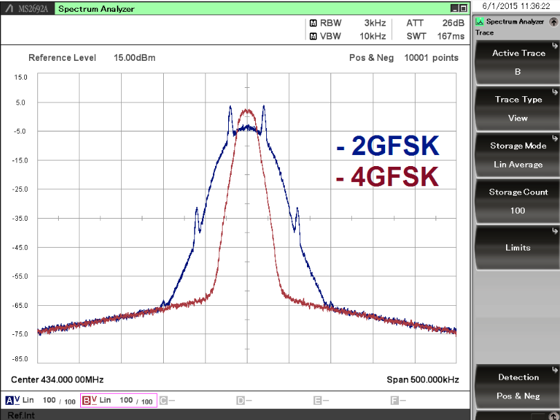

## Concepto de frecuencia

Tengamos presente que la frecuencia es definida como el numero de repeticiones en la unidad de tiempo fundamental.

```
F = 1/T
```
donde F representa la frecuencia y T es el periodo o tiempo en segundos y claramente se observa que son inversamente proporcionales,
si una de ellas crece, la otra disminuye linealmente.

una onda de baja frecuencia necesita mas tiempo para cumplir su ciclo, comparandola con una onda de alta frecuencia.


# Longitud de onda

Por simplicidad definamos la longitud de onda como la distancia entre dos maximos en una onda periodica, generalmente aplicado a senales 
senoidales, pero realmente el concepto aplica para cualquier onda periodica.


# Representacion de senales

Una senal puede ser representada de 2 formas
- En el dominio del tiempo S(t), o representacion cartesiana.
- En el dominio de la frecuencia S(f), o representacion espectral.


# Moduladores

Básicamente, la modulación consiste en hacer que un parámetro de la onda portadora cambie de valor de acuerdo con las variaciones de la senal moduladora, que es la información que queremos transmitir. 
veamos el siguiente grafico, para entender mejor.
En el Grafico se aprecia una onda de color negro , representando la data de forma analoga, la senal portadora o carrier, no se ve en el grafico pero se asume una onda senoidal de alta frecuencia, la grafica roja corresponde a la modulacion por amplitud , lo que quiere decir que la senal portadora se vera afectada en su amplitud pero la  frecuencia seguira intacta, esto la hace susceptible al ruido, debido a que si se genera un cambio de voltaje en la fuente de alimentacion, eso se refleja en la salida de la senal tambien.
el grafico azul muestra la modulacion en frecuencia, donde la amplitud de la onda portadora permanece constante , pero la frecuencia varia de acuerdo a las variaciones de la senal de entrada de color negro o mensaje.
Este tipo de modulacion es inmune al ruido ya que no depende de niveles de tension para para obtener la informacion.


## Frecuencia portadora

Una senal portadora es una onda eléctrica que puede ser modificada en alguno de sus parámetros por la senal de información (sonido, imagen o datos) para obtener una senal modulada y que se transporta por el canal de comunicaciones

El uso de una onda portadora también soluciona muchos problemas de circuito, antena, propagación y ruido. Por ello, una antena práctica debe tener un tamano aproximado al de la longitud de onda de la onda electromagnética de la senal que se va a transmitir. Si las ondas de sonido se difundieran directamente en forma de senales electromagnéticas , la antena tendría que tener más de un kilómetro de altura. Usando frecuencias mucho más altas para la portadora, el tamano de la antena se reduce significativamente porque las frecuencias más altas tienen longitudes de ondas más cortas.

## Frecuencia moduladora

Se le conoce asi a la senal que contiene la informacion, y es la que se encarga de deformar y alterar la senal que hara posible que los datos viajen a traves de una antena en forma de ondas.


# Modulacion digital
es un nombre genérico para técnicas de modulación que utiliza senales discretas para modular una onda portadora. En comparación con  FM y AM que son técnicas analógicas. 
Los tres tipos principales de modulación digital son:
- Ca modulación por desplazamiento de frecuencia **(FSK)**. 
- Codificación por desplazamiento de fase **(PSK)** 
- Codificación por desplazamiento de amplitud **(ASK)**.


## Modulación por desplazamiento de frecuencia (FSK)

La modulación por desplazamiento de frecuencia o FSK del inglés Frequency Shift Keying es una técnica de modulación para la transmisión digital de información utilizando dos o más frecuencias diferentes para cada símbolo.

1​ La senal moduladora solo varía entre dos valores de tensión discretos formando un tren de pulsos donde uno representa un "1" o "marca" y el otro representa el "0" o "espacio".

En la modulación digital, a la relación de cambio a la entrada del modulador se le llama bit-rate y tiene como unidad el bit por segundo (bps).

A la relación de cambio a la salida del modulador se le llama baud-rate. En esencia el baud-rate es la velocidad o cantidad de símbolos por segundo.

En FSK, el bit rate = baud rate. Así, por ejemplo, un 0 binario se puede representar con una frecuencia f1, y el 1 binario se representa con una frecuencia distinta f2. 

donde ```f1 = F - delta``` y ```f2 = F + delta```
el delta o cambio de frecuencia alrededor de la frecuencia portadora es lo que se conocoe como desviacion de frecuencia y es un valor constante del que depende el ancho de banda de la senal modulada  


## Modulación por desplazamiento de frecuencia gausiana

La modulación por desplazamiento de frecuencia gausiana (en inglés Gaussian Frequency Shift Keying o GFSK) es un tipo de modulación donde un 1 lógico es representado mediante una desviación positiva (incremento) de la frecuencia de la onda portadora, y un 0 mediante una desviación negativa (decremento) de la misma. A la entrada del modulador se halla un filtro pasabajo gaussiano que "suaviza" las transiciones de la senal de datos, lo que evita que las senales de altas frecuencias pasen al modulador y aumenta el ancho del pulso por un período mayor que la duración de un bit, lo que puede causar interferencia entre símbolos.

los pulsos digitales (pulsos cuadrados que representan los unos y ceros) son suavizados antes de entrar a la etapa de modulación, esto es, los pulsos cuadrados tienen una forma de onda mas parecido a una onda senoidal, pero sin perder su periodo.


# 1. OOK vs. FSK
   
OOK es un tipo de modulación de amplitud digital, que representa 2 estados diferentes: la presencia o ausencia de la portadora basada en el símbolo a transmitir. Por el contrario, para la modulación FSK, la amplitud de la senal transmitida es fija, pero la frecuencia puede ser diferente en función del símbolo dado.

La activación y desactivación consecutivas del PA (presencia y auscencia) para la modulación OOK hace que el ancho de banda aumente en comparación con la modulación FSK utilizando la misma velocidad de datos, de esta manera FSK es una modulación más espectralmente eficiente. El ancho de banda más amplio hace que sea necesario aplicar un filtro más amplio en el receptor, lo que aumenta el nivel de ruido y de esta manera la sensibilidad empeorará. Si el ancho de banda ocupado es el mismo para la modulación OOK y FSK, la sensibilidad es similar (pero en este caso la modulación OOK tiene una velocidad de datos menor al tener el mismo ancho de banda que FSK). Además de estos, la modulación OOK es más sensible al desvanecimiento, ya que la información se transmite solo por la amplitud. Junto con esto, la modulación FSK es más sensible para las compensaciones de frecuencia entre el transmisor y el receptor.

En resumen, la modulación FSK es más espectralmente eficiente, por lo que tiene una mejor sensibilidad y es menos sensible al desvanecimiento. La modulación OOK es menos sensible a la inexactitud de frecuencia y, por lo tanto, se usa comúnmente en aplicaciones donde no se puede garantizar la precisión de la frecuencia


La figura anterior muestra el espectro de una senal modulada OOK con una velocidad de datos de 40 kbps y una senal modulada 2FSK con una velocidad de datos de 40 kbps y una desviación de 20 kHz.


# 2. FSK vs. GFSK


La modulación FSK crea contenidos espurios de alto nivel (en múltiplos enteros de la velocidad de símbolos), así como lóbulos laterales relativamente altos en el lado del transmisor, lo que puede causar infracciones estándar de la regulación. Se puede aplicar un filtro gaussiano a los símbolos antes de crear la senal de frecuencia modulada para suprimir estos espolones y lóbulos laterales alisando la senal de banda base. De esta manera, el ancho de banda puede reducirse ligeramente, pero la distancia entre los símbolos disminuirá, lo que provoca una sensibilidad del receptor ligeramente peor (~ 0.5 dB) para las senales moduladas GFSK. Aún así, GFSK es un tipo de modulación generalmente utilizado, ya que reduce significativamente los contenidos espurios en el lado del transmisor y la pérdida de sensibilidad es insignificante.


La figura anterior muestra el espectro de una señal modulada 2FSK y 2GFSK con una velocidad de datos de 40 kbps y una desviación de 20 kHz.


# 3. 2GFSK vs. 4GFSK

 

Una aplicación típica de la modulación **4GFSK** es transmitir con la misma velocidad de datos pero ocupando solo la mitad del ancho de banda de la senal **2GFSK**. Por ejemplo, **2GFSK**, velocidad de datos de 40 kbps, desviación de 20 kHz (OBW = 80 kHz) y 4GFSK, velocidad de símbolo de 20 kps (= velocidad de datos de 40 kbps), desviación externa de 10 kHz (= desviación interna de 10/3 kHz) (OBW = 40 kHz) . El ancho de banda más pequeño introduce un nivel de ruido más bajo en el receptor, lo que resulta en una mejora de la sensibilidad. Por otro lado, la desviación en los símbolos internos será menor, lo que causa pérdida de sensibilidad. Los dos efectos se compensan entre sí, pero el último tiene un efecto más fuerte sobre la sensibilidad, por lo que eventualmente en este caso **4GFSK** tendrá una sensibilidad ligeramente (~ 2 dB) peor que **2GFSK**.

 

Para tener el mismo ancho de banda ocupado para **4GFSK** que **2GFSK**, debemos usar una velocidad de datos más alta. Por ejemplo, **2GFSK**, velocidad de datos de 100 kbps, desviación de 50 kHz (OBW = 200 kHz) y **4GFSK**, velocidad de símbolo de 100 kps (= velocidad de datos de 200 kbps), desviación externa de 50 kHz (= desviación interna de 50/3 kHz) (OBW = 200 kHz) . De esta manera, el ancho de banda ocupado será el mismo, pero la desviación (interna) será menor para 4GFSK, lo que eventualmente resulta en una degradación de la sensibilidad (~ 5 dB).

En resumen, **4GFSK** se usa generalmente para transmitir con la misma velocidad de datos en la mitad del ancho de banda que 2GFSK, o para ocupar el mismo ancho de banda usando una velocidad de datos más alta. En ambos casos, **4GFSK** tendrá una sensibilidad peor.

 

 La figura anterior muestra el espectro de una señal modulada 2GFSK con una velocidad de datos de 40 kbps y una desviación de 20 kHz y una señal modulada 4GFSK con una velocidad de símbolo de 20 ksps y una desviación externa de 10 kHz.
 


Según las razones explicadas anteriormente, nuestra recomendación es la modulación 2GFSK, ya que es más eficiente espectralmente que OOK o 2FSK, el filtro gaussiano suprime significativamente el contenido espurio y los lóbulos laterales en el lado del transmisor, mientras que la sensibilidad del receptor es ligeramente peor que 2FSK y unos pocos dB mejor que 4GFSK.