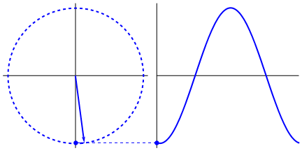

## Concepto de frecuencia

Tengamos presente que la frecuencia es definida como el numero de repeticiones en la unidad de tiempo fundamental.

```
F = 1/T
```
donde F representa la frecuencia y T es el periodo o tiempo en segundos y claramente se observa que son inversamente proporcionales,
si una de ellas crece, la otra disminuye linealmente.

una onda de baja frecuencia necesita mas tiempo para cumplir su ciclo, comparandola con una onda de alta frecuencia.


# Longitud de onda

Por simplicidad definamos la longitud de onda como la distancia entre dos maximos en una onda periodica, generalmente aplicado a senales 
senoidales, pero realmente el concepto aplica para cualquier onda periodica.


# Representacion de senales

Una senal puede ser representada de 2 formas
- En el dominio del tiempo S(t), o representacion cartesiana.
- En el dominio de la frecuencia S(f), o representacion espectral.


# Moduladores

Básicamente, la modulación consiste en hacer que un parámetro de la onda portadora cambie de valor de acuerdo con las variaciones de la señal moduladora, que es la información que queremos transmitir. 
veamos el siguiente grafico, para entender mejor.
En el Grafico se aprecia una onda de color negro , representando la data de forma analoga, la senal portadora o carrier, no se ve en el grafico pero se asume una onda senoidal de alta frecuencia, la grafica roja corresponde a la modulacion por amplitud , lo que quiere decir que la senal portadora se vera afectada en su amplitud pero la  frecuencia seguira intacta, esto la hace susceptible al ruido, debido a que si se genera un cambio de voltaje en la fuente de alimentacion, eso se refleja en la salida de la senal tambien.
el grafico azul muestra la modulacion en frecuencia, donde la amplitud de la onda portadora permanece constante , pero la frecuencia varia de acuerdo a las variaciones de la senal de entrada de color negro o mensaje.
Este tipo de modulacion es inmune al ruido ya que no depende de niveles de tension para para obtener la informacion.


## Frecuencia portadora

Una señal portadora es una onda eléctrica que puede ser modificada en alguno de sus parámetros por la señal de información (sonido, imagen o datos) para obtener una señal modulada y que se transporta por el canal de comunicaciones

El uso de una onda portadora también soluciona muchos problemas de circuito, antena, propagación y ruido. Por ello, una antena práctica debe tener un tamaño aproximado al de la longitud de onda de la onda electromagnética de la señal que se va a transmitir. Si las ondas de sonido se difundieran directamente en forma de señales electromagnéticas , la antena tendría que tener más de un kilómetro de altura. Usando frecuencias mucho más altas para la portadora, el tamaño de la antena se reduce significativamente porque las frecuencias más altas tienen longitudes de ondas más cortas.

## Frecuencia moduladora

Se le conoce asi a la senal que contiene la informacion, y es la que se encarga de deformar y alterar la senal que hara posible que los datos viajen a traves de una antena en forma de ondas.


## Modulación por desplazamiento de frecuencia

La modulación por desplazamiento de frecuencia o FSK del inglés Frequency Shift Keying es una técnica de modulación para la transmisión digital de información utilizando dos o más frecuencias diferentes para cada símbolo.

1​ La señal moduladora solo varía entre dos valores de tensión discretos formando un tren de pulsos donde uno representa un "1" o "marca" y el otro representa el "0" o "espacio".

En la modulación digital, a la relación de cambio a la entrada del modulador se le llama bit-rate y tiene como unidad el bit por segundo (bps).

A la relación de cambio a la salida del modulador se le llama baud-rate. En esencia el baud-rate es la velocidad o cantidad de símbolos por segundo.

En FSK, el bit rate = baud rate. Así, por ejemplo, un 0 binario se puede representar con una frecuencia f1, y el 1 binario se representa con una frecuencia distinta f2. 

donde ```f1 = F - delta``` y ```f2 = F + delta```
el delta o cambio de frecuencia alrededor de la frecuencia portadora es lo que se conocoe como desviacion de frecuencia y es un valor constante del que depende el ancho de banda de la senal modulada  


## Ancho de banda de una senal

